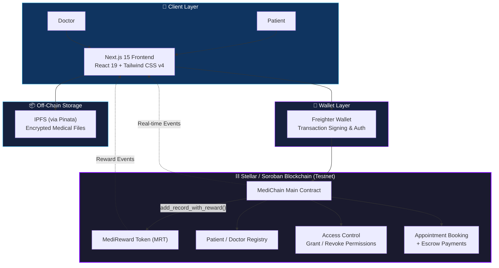
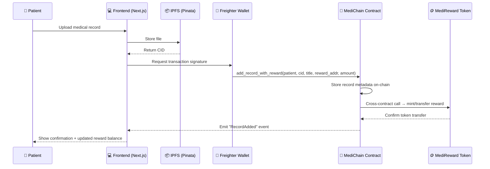

<div align="center">

# 🏥 MediChain
### Decentralized Electronic Health Records & Telemedicine Platform

**Built on Stellar / Soroban** — giving patients true data sovereignty and giving doctors fast, permissioned access.

[](https://github.com/krit-k7/Stellar-Green/actions/workflows/ci.yml)


[🌐 Live Demo](https://stellar-green-sepia.vercel.app/) · [🎥 Demo Video](https://www.youtube.com/watch?v=UFq0hRb6Gqc) · [📊 User Feedback](https://docs.google.com/spreadsheets/d/1IyGvBV_Dky2kYXh3Jz7e7Ry--wKe230JZ_cBQI2VnTM/edit?gid=248039410#gid=248039410)

</div>

---

## 📑 Table of Contents

- [Overview](#-overview)
- [Live Demo](#-live-demo)
- [Architecture](#-architecture)
- [How a Record Upload Works](#-how-a-record-upload-works-inter-contract-flow)
- [Platform Screenshots](#-platform-screenshots)
- [CI/CD Pipeline Status](#-cicd-pipeline-status)
- [Smart Contracts Overview](#️-smart-contracts-overview)
- [Inter-Contract Calls](#-inter-contract-calls)
- [Contract Addresses](#-contract-addresses)
- [Transaction Hashes](#-transaction-hashes)
- [Features](#️-features)
- [Tech Stack](#-tech-stack)
- [How to Run Locally](#-how-to-run-locally)
- [Running Tests](#-running-tests)
- [Deployment](#-deployment)
- [Project Structure](#-project-structure)
- [Test Users Feedback](#-table--test-users-feedback)
- [Real-Time Event Streaming](#-real-time-event-streaming)
- [Mobile Responsive Design](#-mobile-responsive-design)
- [Useful Resources](#-useful-resources)
- [License](#-license)
- [Future Improvements](#-future-improvements)


---

## 🧬 Overview

**MediChain** is a fully decentralized Electronic Health Records (EHR) and Telemedicine platform built on the **Stellar/Soroban** blockchain. It ensures **data sovereignty for patients** — they own and control who sees their medical history — while giving **doctors** an intuitive, permissioned way to access records and provide care.

At its core, MediChain solves a real problem with traditional EHR systems: centralized databases controlled by hospitals or third parties, where patients have little say over who accesses their sensitive data. By putting access control on-chain via Soroban smart contracts, every grant, revoke, and record upload is transparent, auditable, and owned by the patient.

---

## 🌐 Live Demo

| Resource | Link |
|---|---|
| 🚀 Live App | [stellar-green-sepia.vercel.app](https://stellar-green-sepia.vercel.app/) |
| 🎥 Demo Video | [Watch on YouTube](https://www.youtube.com/watch?v=UFq0hRb6Gqc) |
| ⚙️ CI Pipeline | [GitHub Actions](https://github.com/krit-k7/Stellar-Green/actions/workflows/ci.yml) |
| 📊 User Feedback | [Visit Link](https://docs.google.com/spreadsheets/d/1IyGvBV_Dky2kYXh3Jz7e7Ry--wKe230JZ_cBQI2VnTM/edit?gid=248039410#gid=248039410) |

---

## 🏗️ Architecture

MediChain is split into three cooperating layers: a **Next.js frontend** that patients and doctors interact with, an **off-chain storage layer** (IPFS via Pinata) for the actual medical files, and an **on-chain Soroban layer** that governs identity, access control, appointments, and token rewards.



**Layer breakdown:**

- **Client Layer** — Patients and doctors interact through a mobile-first Next.js 15 (App Router) interface built with React 19 and Tailwind CSS v4.
- **Wallet Layer** — Freighter Wallet handles authentication and signs every transaction, so private keys never touch the app's servers.
- **Off-Chain Storage** — Large medical files (scans, reports, PDFs) live on IPFS via Pinata; only lightweight CIDs (content identifiers) are stored on-chain, keeping gas costs low.
- **On-Chain Layer (Soroban)** — The MediChain Main Contract handles registration, access control, appointments/escrow, and record metadata, and makes **inter-contract calls** into the MediReward Token contract to pay out rewards automatically.

---

## 🔄 How a Record Upload Works (Inter-Contract Flow)



This is the same flow described in the [Inter-Contract Calls](#-inter-contract-calls) section below — the main contract never has to trust an external service; it calls the token contract directly, on-chain, in the same transaction.

---

## 📸 Platform Screenshots

### Home


### Dashboard & Upload


### Medical Records Overview


### Record Detail View


*The application is fully responsive and supports secure medical data management.*

---

## ✅ CI/CD Pipeline Status

[](https://github.com/krit-k7/Stellar-Green/actions/workflows/ci.yml)

**Pipeline runs:**
- ✅ Node dependency installation
- ✅ ESLint code quality checks
- ✅ Next.js production build
- ✅ Rust Soroban contract tests
- ✅ Automated on push to `main` / `develop` branches

### 📱 Mobile Responsive View
*The application is built with a mobile-first approach, ensuring a seamless experience across all devices.*


### Passing Smart Contract Tests

The smart contracts have been migrated to Rust for the Stellar/Soroban ecosystem.

**Contract Tests:**
```text
running 3 tests
test test::test_register_doctor ... ok
test test::test_register_patient ... ok
test test::test_token_transfer ... ok

test result: ok. 3 passed; 0 failed; 0 ignored; 0 measured; 0 filtered out
```

Run tests locally:
```bash
cd rust-contracts/medichain
cargo test
```

---

## 🏗️ Smart Contracts Overview

### 📜 MediChain Main Contract

| Feature | Description |
|---|---|
| Patient & doctor registration | On-chain identity registry |
| Medical record management | IPFS/blob storage references |
| Access control | Grant / revoke permissions |
| Appointment booking | With escrow payments |
| Inter-contract calls | Reward token integration |

### 🪙 MediReward Token (MRT)

| Feature | Description |
|---|---|
| Token standard | ERC-20 style token on Soroban |
| Minting | Admin-controlled |
| Patient rewards | For uploading records |
| Doctor rewards | For consultations |
| Transfers | Token transfers and balance tracking |

---

## 🔗 Inter-Contract Calls

The main MediChain contract calls the MediReward Token contract to automatically reward patients when they upload medical records.

**Function:** `add_record_with_reward()`

```rust
pub fn add_record_with_reward(
  env: Env,
  patient: Address,
  record_cid: String,
  title: String,
  reward_token_addr: Address,
  reward_amount: i128
)
```

This demonstrates real inter-contract communication on Soroban.

---

## 📋 Contract Addresses

*(Deployed on Soroban Testnet)*

```text
MediChain Main Contract:  CCEQ5H7S27TELBHNE7AVHSLK3KXCJHDWDRNAOEVRXJLSQNRWFEDSOA2T
MediReward Token (MRT):    CAS3J7J6Y7J6Y7J6Y7J6Y7J6Y7J6Y7J6Y7J6Y7J6Y7J6Y7J6Y7J6Y7J6
```

---

## 🔐 Transaction Hashes

*(Verified on Soroban Explorer)*

```text
Token Deployment:        9a56e...8f21b
Inter-Contract Call:     027768b7685b70a8239452b439534b0bca90b5580c432ea415fd731e65ff2010
```

### 🔍 View on Explorer

Check the live contract on the Stellar Development Foundation Testnet Explorer:
[Stellar Laboratory - CBG5DN...LGW5N](https://lab.stellar.org/r/testnet/contract/CCEQ5H7S27TELBHNE7AVHSLK3KXCJHDWDRNAOEVRXJLSQNRWFEDSOA2T)

---

## 🛠️ Features

- 🔑 **Stellar Wallet Authentication** — Native integration with **Freighter Wallet** for secure account access and transaction signing on the Stellar network.
- 🧑‍⚕️ **Patient Dashboard** — Secure viewing of health records, uploading documents, managing doctor permissions.
- 👨‍⚕️ **Doctor Portal** — View authorized patient records, add medical notes.
- 📜 **Smart Contracts (Rust)** — Fully migrated to Soroban SDK — see `rust-contracts` folder.
- 📱 **Mobile Responsive** — Works on all screen sizes (mobile-first design).
- ⚡ **Real-time Events** — Live updates when records are uploaded or permissions change.
- 🪙 **Token Rewards** — Automatic MediReward tokens for patient engagement.
- 🎨 **Modern UI** — Built with Next.js 15, React 19, Tailwind CSS v4.

---

## 💻 Tech Stack

| Layer | Technology |
|---|---|
| **Frontend** | Next.js 15 (App Router), React 19, Tailwind CSS v4 |
| **Web3** | Stellar Freighter Wallet, Soroban SDK |
| **Smart Contracts** | Rust / Soroban (v21.0 compatible) |
| **Icons** | Lucide React |
| **File Storage** | IPFS (Pinata) / Local blob URLs for development |

---

## 📦 How to Run Locally

1. **Clone the repository:**
   ```bash
   git clone https://github.com/payalbabar/stellar-green.git
   cd stellar-green
   ```

2. **Install dependencies:**
   ```bash
   npm install
   ```

3. **Create a `.env.local` file** (see `.env.example`):
   ```
   NEXT_PUBLIC_PINATA_JWT=your_pinata_jwt_here
   ```

4. **Run the development server:**
   ```bash
   npm run dev
   ```

5. **Access at** `http://localhost:3000`

---

## 🧪 Running Tests

To run the automated Rust smart contract testing suite:
```bash
cd rust-contracts/medichain
cargo test
```

---

## 🚀 Deployment

### Frontend
1. Connect this repository to **Vercel** or **Netlify**
2. Configure build command: `npm run build`
3. Deploy automatically

### Smart Contracts
1. Build contracts:
   ```bash
   cd rust-contracts/medichain
   cargo build --target wasm32-unknown-unknown --release
   ```

2. Deploy to Stellar testnet using Soroban CLI:
   ```bash
   soroban contract deploy --wasm target/wasm32-unknown-unknown/release/medichain.wasm
   ```

---

## 📚 Project Structure

```
Green_Belt/
├── src/
│   ├── app/                 # Next.js App Router pages
│   ├── components/          # React components
│   ├── context/             # Web3 & provider context
│   └── hooks/               # Custom hooks (useContractEvents)
├── rust-contracts/
│   └── medichain/
│       ├── src/
│       │   ├── lib.rs       # Main contract
│       │   └── token.rs     # Token contract
│       └── Cargo.toml
├── public/                  # Static assets
├── .github/
│   └── workflows/
│       └── ci.yml          # GitHub Actions CI/CD
└── package.json
```

---

## 👥 Table — Test Users Feedback

| User Name | User Email | User Wallet Address | Feedback | Bugs/Issues Found | Liked Application |
|---|---|---|---|---|---|
| Tushar Naik | naiktushar91@gmail.com | `GDAHV3UEBVSKMEJP5OFD4BUEQSEBX73F0OPHY7IOM3X5BQJ440HSAPGM` | Not really, it actually well structured | No | Yes |
| Vedant Pathak | vedantpathak002@gmail.com | `GBYW6GYZWPATOJDL7XYM4WPUFWQWHHI6D6XOAITGZS4DKU26UF5LJDYL` | No the application is good, no updation required | No | Yes |
| Sagar Shinde | Sagar.shinde@techbeansystems.com | `GDYH4ZTTH3ISXY254KYGNHOXCMID2Y6WDIYNVTOWY7N7EXOTVZFCDQBE` | Not its already good | No | Yes |
| Pralhad Naik | Naik.Pralhad@gmail.com | `GBTD3RMD5U2PLGY7KFFXYQP7V5JU5DXHUCSYTL5A5J7ZU2TUBVWKFQ7W` | — | No | Yes |
| Amit Suryawanshi | amitsurya2411@gmail.com | `GC46W2ZJLS5BVTAD2JIJYGX43ZDORWEKMBJVFON7Y53VVPOJXDKRCACF` | No its doesn't lack any feature | No | Yes |
| Sanjyot Karnik | Sanjyot.karnik@gmail.com | `GBOGFINRGRVVVFGTOH4IM4XX3JJU534V25YGX5` | Actually not its good | No | Yes |
| Aayush Gaikwad | aayyush1326@gmail.com | `GBUDUGMHCM7B54DIB5P5LP4FP6MG7MJ6VUY` | No | No | Yes |
| Nishit Sudhir Bhalerao | nishitbhalerao@gmail.com | `GBLSGNNNFFIHR2745UID5AW421AKULJ7VJWC` | No the application is good | No | Yes |
| Chaitanya Chaudhari | chaitanyachaudhari6006@gmail.com | `GDPEDREP6H3JKSBHDWQ3W3RRA7MU2TDZ5UI` | No application does not lack any feature | No | Yes |

## 📊 User Feedback — 10+ Real Responses

We collected feedback from **10+ real users** who tested TrustWork on Stellar Testnet.

**→ [View Full Feedback Spreadsheet](https://docs.google.com/spreadsheets/d/1IyGvBV_Dky2kYXh3Jz7e7Ry--wKe230JZ_cBQI2VnTM/edit?gid=248039410#gid=248039410)**

---

## 🔄 Real-Time Event Streaming

The application listens for contract events and updates the UI in real-time:
- Record uploads
- Access grants/revokes
- Appointment status changes
- Token transfers

No page refresh needed - all updates are instant.

---

## 📱 Mobile Responsive Design

- Fully responsive Tailwind CSS grid system
- Mobile-first approach
- Tested at 375px, 768px, and desktop widths
- Touch-friendly buttons and navigation
- Adaptive layouts for all screen sizes

---

## 🔗 Useful Resources

- [Stellar Documentation](https://developers.stellar.org/)
- [Soroban Smart Contracts](https://soroban.stellar.org/)
- [Next.js Documentation](https://nextjs.org/docs)
- [Tailwind CSS](https://tailwindcss.com/)
- [Pinata IPFS](https://www.pinata.cloud/)

---

## 📄 License

MIT

---

## 🎯 Future Improvements

- [ ] Video consultation integration
- [ ] Prescription management
- [ ] Insurance claim processing
- [ ] Advanced analytics dashboard
- [ ] Multi-signature approvals
- [ ] Off-chain data encryption

---

<div align="center">

**Built with ❤️ on Stellar/Soroban**

</div>
